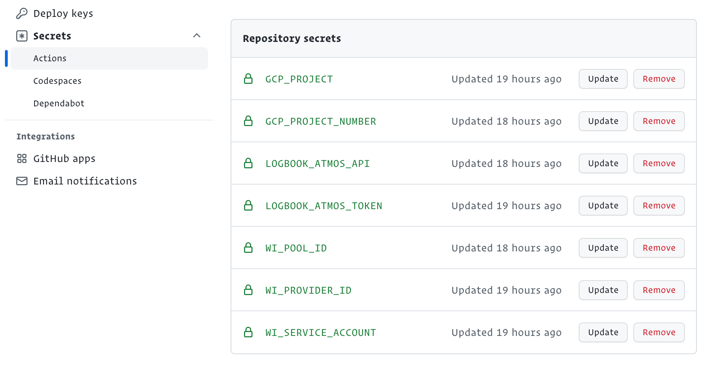
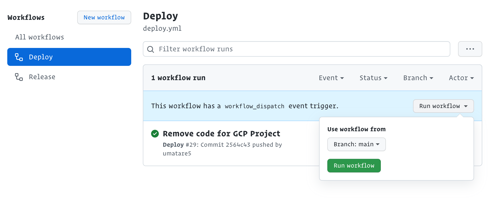

# Renew access-token

When you fail to fetch divelogs, you should update access-token.

- Fetch access-token.

  ```bash
  atmos-login authenticate | jq .response.token -r
  ```

- Update `LOGBOOK_ATMOS_TOKEN` in [umatare5/logbook-api: Secrets - Actions](https://github.com/umatare5/logbook-api/settings/secrets/actions).

  

- Click `Run workflow` in [Github Actions: Deploy](https://github.com/umatare5/logbook-api/actions/workflows/deploy.yml).

  
